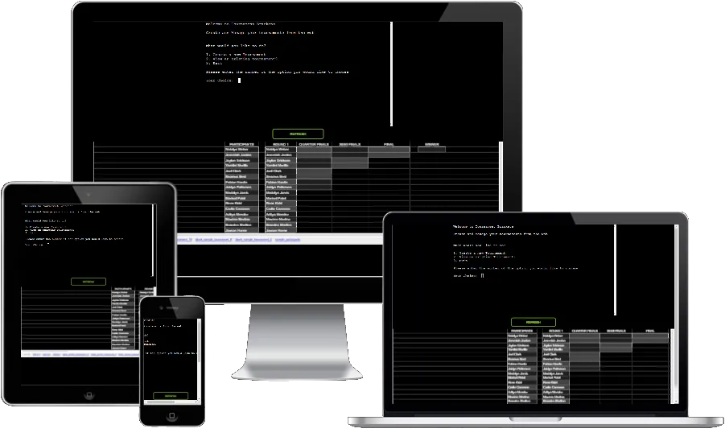

# Tournament Brackets
Tournament Brackets is a web-based Command Line Interface (CLI) application that allows users to create and operate knockout tournament brackets. It also has an embedded Google Sheet which keeps track of all the tournaments and their results.

The user can create and operate as many tournaments as they like. They can enter their own participants or use the sample data. 

Visit the Live Website [HERE](https://tournament-brackets-ec84b8ac2e43.herokuapp.com/)

## Instructions
- Create a new tournament.
- Input how many participants you would like to include in your tournament.
- Decide if you want to input your own participants or use the sample data.
- Run the brackets of your tournament to decide a winner.
- View or delete your tournaments as you please.

## Site Owner Goals
- Make a useful tournament management application, where data can be stored and edited.
- Provide an intuitive user experience that ensures the user can easily navigate the app. 
- To provide a storage solution for historical tournaments.

## User Stories

- ### As a user I want to:
  - Create and manage my tournaments.
  - Operate the tournament brackets to be able to decide the winner.
  - Have multiple options for different tournament sizes.
  - Be guided through the app with intuitive input validation.
  - Record the results of my tournaments.
  - Be able to view my tournaments.
  - Have the ability to delete my tournament data

## Logic Flow
To visualize the sequence of steps necessary for the application to work as desired, I utilized [Lucid Chart](https://www.lucidchart.com) to create a flowchart. It helped me plan the project by showing what functions the application needed, when they were needed, and how different parts of the application would work together.

## Deployment

The application is currently deployed using the Heroku Cloud Application Platform

To achieve this, I followed these steps:

1. Create an account on Heroku and log in.
2. From the home dashboard, click the "New" button located at the top right corner. From the drop-down menu, choose "Create New App.".
3. Enter the name of your app.
4. Choose the region in which you are located.
5. Click the 'Create App' button.
6. Click on the Settings Tab.
7. Scroll to the 'Config Vars' section and click 'Reveal Config Vars'.
8. Enter the word 'port' into the 'KEY' section and '8000' into the 'VALUE' section, then click 'Add'.
9. In the following 'KEY' section, enter the word 'CREDS', in the corresponding 'VALUE' section, paste the contents of your creds.json file, which contains your Google Sheets API Key.
10. Scroll to the 'Buildpack' section below and click 'Add Buildpack'. Click the 'Python' button and click 'Add Buildpack'.
11. Repeat step 10 to add the 'node.js' buildpack as well. Ensure that the order of these two steps is correct.
12. That's all for the 'Settings' tab, scroll back to the top and click the 'Deploy' tab.
13. In the 'Deployment Method' section, click 'GitHub'.
15. Connect to GitHub.
16. Enter the name of the repository and click the 'Search' button.
17. Select the correct repo.
17. Scroll down to the 'Manual Deploy' Section and click 'Deploy Branch'
18. Watch the build log to see if any errors occur.
19. If all is successful you will see a green tick and the words 'Your app was successfully deployed', if not, see above.
20. Click the 'View' Button to see the live deployed version of your app.

## Credits 
### Resources Used
- [GSPREAD DOCS](https://docs.gspread.org/en/v6.0.0/) I relied heavily on the Gspread documentation to implement the features which query and push to the Google Worksheet.
- [This](https://www.programiz.com/python-programming/examples/random-number) Programiz tutorial showed me how to create a random number in Python.
- [This](https://developer.mozilla.org/en-US/docs/Web/HTML/Element/iframe) MDN Web Doc helped me implement the iframe
- [Google](https://www.google.com) Search helped me innumerable times to find the correct syntax for methods.
## Acknowledgments
I would like to thank my Mentor Antonio Rodriguez for giving me guidance on this project.