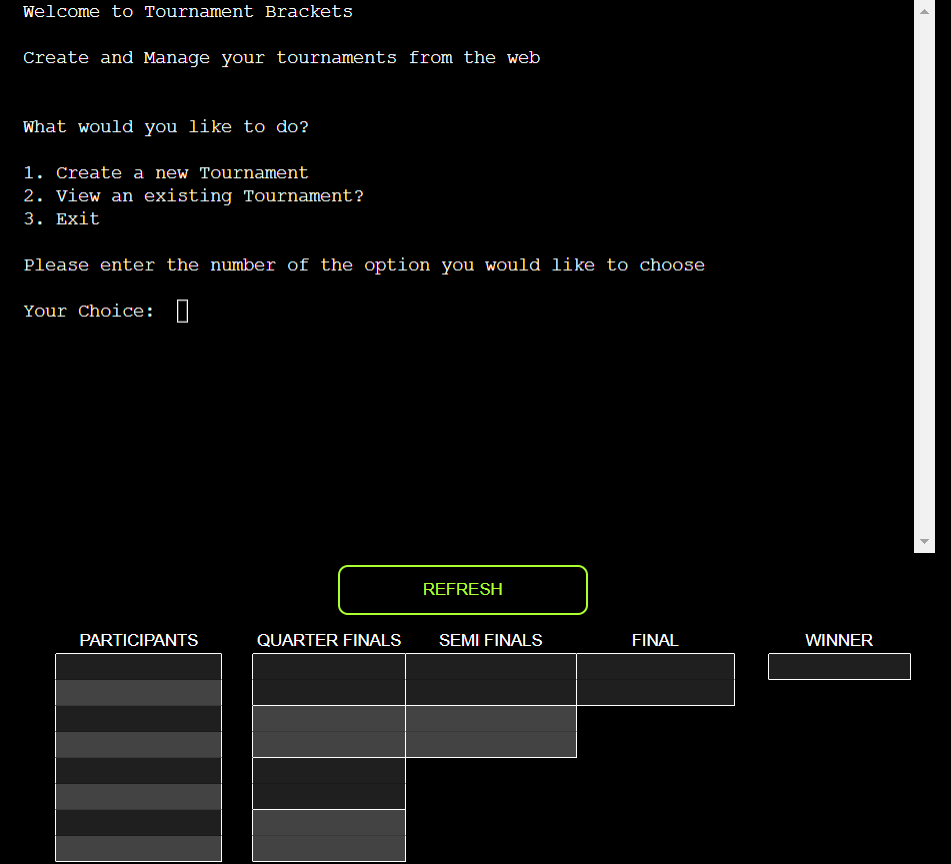
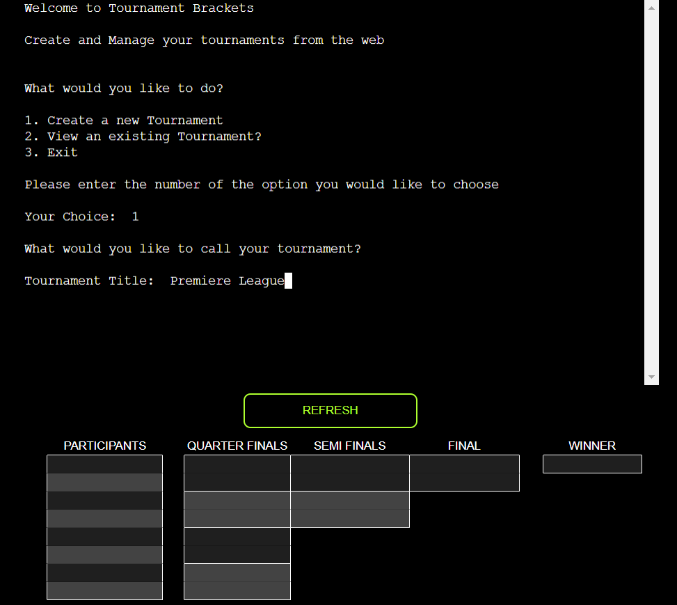
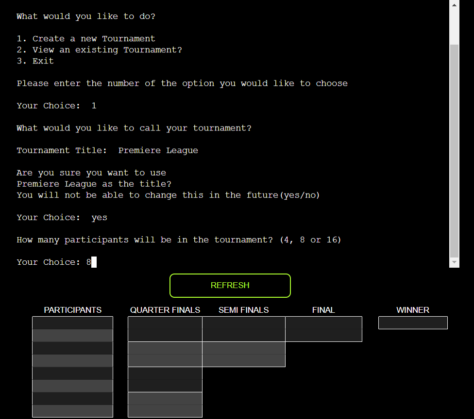
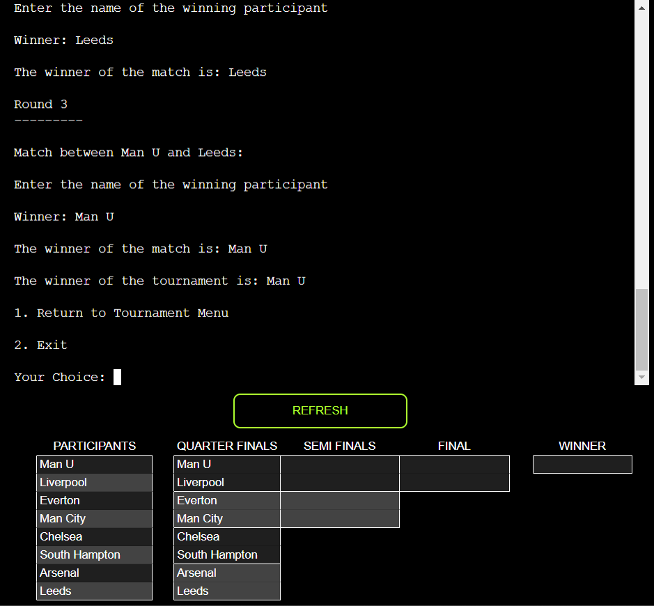
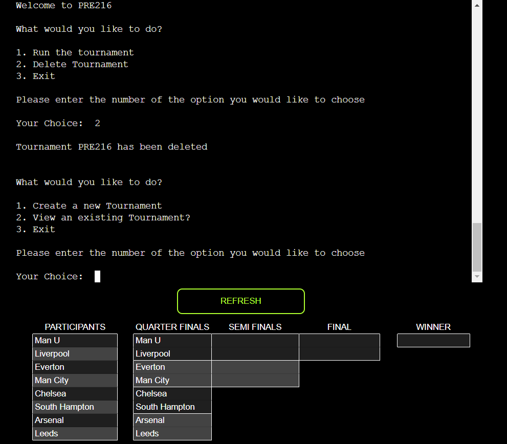

# Tournament Brackets
Tournament Brackets is a web-based Command Line Interface (CLI) application that allows users to create and operate knockout tournament brackets. It also has an embedded Google Sheet which keeps track of all the tournaments and their results.

The user can create and operate as many tournaments as they like. They can enter their own participants or use the sample data. 

Visit the Live Website [HERE](https://tournament-brackets-ec84b8ac2e43.herokuapp.com/)

## Instructions
- Create a new tournament.
- Input how many participants you would like to include in your tournament.
- Decide if you want to input your own participants or use the sample data.
- Run the brackets of your tournament to decide a winner.
- View or delete your tournaments as you please.

## Site Owner Goals
- Make a useful tournament management application, where data can be stored and edited.
- Provide an intuitive user experience that ensures the user can easily navigate the app. 
- To provide a storage solution for historical tournaments.

## User Stories

- ### As a user I want to:
  - Create and manage my tournaments.
  - Operate the tournament brackets to be able to decide the winner.
  - Have multiple options for different tournament sizes.
  - Be guided through the app with intuitive input validation.
  - Record the results of my tournaments.
  - Be able to view my tournaments.
  - Have the ability to delete my tournament data

## Features 

### Welcome Screen/Main Menu
- Functionality: Users are presented with a simple welcome message and options to create a new tournament, view existing tournaments, or exit the application.
- Options:
  1. Create a new Tournament
  2. View Existing Tournament
  3. Exit the application
- Error Handling: 
  - Ensures User can only input one of the options on the menu.

### Create a New Tournament
- Functionality: Allows users to create a new tournament by specifying the title, number of participants, and participant entry method.
- Steps:
  1. User provides a title for the tournament.
  
  2. User confirms title selection
  
  2. User selects the number of participants (4, 8, or 16).
  
  3. User chooses to enter participants manually or import sample participants.
  
  4. Upon successful creation, the app generates a unique tournament ID for future
     reference.
- Error Handling:
  - Limits the number of characters in a title.
  - Checks for invalid input regarding the number of participants.
  - Generates a unique tournament ID to avoid conflicts with existing tournaments.

### Manage Participants
- Functionality: Provides options for entering participants into the tournament.
- Options:
  - Enter Participants Manually: Users input participant names individually.
  
  - Use Sample Participants: Participants are imported from a predefined list.
  
- Error Handling:
  - Ensures the correct number of participants is entered based on the chosen tournament size.
  - Prevents duplicate participant names and empty inputs.

### View Existing Tournaments
- Functionality: Enables users to view existing tournaments by providing the tournament ID.
- Steps:
1. User selects the option to view an existing tournament.
2. User inputs the tournament ID to access the tournament details.
- Error Handling:
  - Verifies the provided tournament ID to ensure it corresponds to an existing tournament.

### Tournament Menu
  - Functionality: Acts as a menu to allow users to manage their Tournament

### Run a Tournament
- Functionality: Executes the tournament matches and determines the winner.
- Steps:
1. The app generates match pairings based on the number of participants.
2. Users input the winners of each match.

3. The app progresses through the rounds until a tournament winner is determined.
4. Upon completion, the winner is displayed, and users can choose to return to
   the tournament menu or exit the app.
- Error Handling:
  - Validates user input for match winners to ensure it matches the names of
    participants.

### Delete a Tournament
- Functionality: Allows users to delete a tournament, removing all associated data.
- Steps:
1. User selects the option to delete a tournament.

### Exit Application
- Functionality: Allows users to exit the application.
- Steps:
  1. User selects option to exit the application.
  2. User is thanked for their usage and prompted to click the refresh button if
     they would like to use the application again.

## Data Model
The data model of the Tournament Bracket App primarily revolves around two main entities:
1. Tournament
  Attributes:
  - Title: The name of the tournament.
  - ID: A unique identifier for the tournament.
  - Participants: A list of participants involved in the tournament.
  - Size: The number of participants in the tournament (4, 8, or 16).
  - Matches: Pairings between participants in each round.
  - Winner: The final winner of the tournament.

2. Participant:
  Attributes:
  - Name: The name of the participant.

## Business Logic:
The business logic of the Tournament Bracket App follows these key principles:

1. User Interaction:
- The application provides a user-friendly interface with clear instructions and prompts.
- Input validation ensures that users provide correct and relevant information at each step.

2. Data Management:
- Tournaments and participant data are stored in Google Sheets for easy access and management.
- Unique tournament IDs prevent conflicts and ensure data integrity.

3. Error Handling:
- The app includes robust error handling mechanisms to handle edge cases and prevent crashes.
- Users are notified of any invalid inputs or operations and prompted to provide valid inputs or actions.

4. Scalability and Flexibility:
- The application is designed to accommodate tournaments of various sizes (4, 8, or 16 participants).
- It allows users to choose between manual participant entry and importing sample participants, providing flexibility in tournament setup.

5. Data Security:
- Google OAuth2 authentication ensures secure access to Google Sheets, protecting tournament data from unauthorized access.

## Testing

### Manual Testing
In my endeavour to ensure the reliability and functionality of the Tournament Brackets app, I meticulously conducted a series of manual tests covering various aspects of its functionality. I did this in both the local version, and the live version. Below are the steps I took to validate the app:

#### Menu Navigation:
- Input: Entered the all the choices from the all the menus
- Outcome: Ensure correct navigation through the application.

#### Creating a New Tournament:
- Input: Entered the title for the tournament.
- Outcome: Verified that a new tournament sheet was created with a unique ID and the appropriate size, ensuring seamless tournament management.

#### Adding Participants Manually:
- Input: Entered a list of participant names separated by commas.
- Outcome: Confirmed that participants were seamlessly added to the tournament sheet without any duplicates or empty entries, maintaining data integrity.

#### Importing Participants from Sample Data:
- Input: Choose to import sample participants.
- Outcome: Carefully imported sample participants to the tournament sheet, ensuring accurate data transfer and reflection in the app.

#### Running Matches:
- Input: Simulated match outcomes by entering the winning participant.
- Outcome: Ensured that matches progressed smoothly through rounds until a deserving winner was determined, facilitating fair competition.

#### Viewing an Existing Tournament:
- Input: Entered the ID of an existing tournament.
- Outcome: Validated that the app displayed the correct tournament and provided intuitive options to run matches, delete tournaments, or exit, enhancing user convenience.

#### Deleting a Tournament:
- Input: Choose to delete an existing tournament.
- Outcome: Verified that upon selecting the option to delete a tournament, the corresponding tournament sheet was promptly removed, ensuring efficient management of tournament data.

#### Error Handling - Invalid Inputs:
- Input: Provided invalid inputs during various operations (e.g., incorrect tournament ID, invalid number of participants).
- Outcome: Ensured that the app responded appropriately by displaying clear error messages and guiding users to input valid data, thereby enhancing user experience and minimizing errors.

#### Performance Testing:
- Input: Created tournaments with a large number of participants (e.g. 16 participants).
- Outcome: Rigorously tested performance under load, confirming that the app's responsiveness remained optimal, even when handling a significant number of participants, thereby ensuring uninterrupted tournament management.

### Concurrency Testing:
- Input: Simulated concurrent user interactions (e.g., multiple users adding participants or running matches simultaneously).
- Outcome: Confirmed that the app maintained data integrity and consistency, even under simultaneous user interactions, thus ensuring a stable and reliable platform for managing tournaments.

Following these rigorous testing procedures, I ensured that the Tournament Brackets app met the highest standards of reliability, functionality, and user experience, providing users with a seamless and enjoyable tournament management experience.

### Code Validation
I used the Code Institute [Python Linter](https://pep8ci.herokuapp.com/) to
validate the code base for the application.

## Bugs

### Resolved
1. Deleting tournament and exiting program
  - Issue:
    When a user deleted a tournament and exited the program, the program was
    still stuck in the choose_participants while loop.
  - Resolution:
    I fixed this by adding a
    break to end the loop after the parameters had been met.

2. Uneven number of Participants
  - Issue:
    User could enter an uneven number of participants which would then not
    correctly divide into the tournament matches.
  - Resolution:
    I changed the function to only accept either 4, 8 or 16 participants, with
    input validation to ensure this requirement.

### Unresolved
1. Embedded Google Sheet
  - Context:
    By embedding the Google sheet into the application, I thought it would
    greatly improve the User Interface (UI). I had planned to use this to
    display the progress of the rounds live to the user as they progressed
    through the tournament management. 
  - Issue:
    The iframe in which the Google sheet is embedded in does not live update how it is supposed to. I was unable to program the iframe to
    refresh often enough, or at all for that matter, so that the user can see
    the progress and results of the tournament. The iframe also seems to cache
    in the browser, so upon refreshing the page, it does not always refresh the
    iframe, showing any new events the user may have added.

2. User can delete other people's tournaments
  - Context:
    I had planned on implementing a system by which a user would not be able to
    access another user's tournaments
  - Issue:
    I failed to implement this functionality, meaning any user is able correctly
    to access and in turn, delete another user's tournaments.

## Technologies and Libraries Used

### Technologies
- The app was planned using [Lucidchart](https://lucid.app/documents#/dashboard).
- Developed in [VS Code](https://code.visualstudio.com/).
- Version controlled with [GitHub](https://github.com/).
- Validated with [CI Python Linter](https://pep8ci.herokuapp.com/).
- Spell checked with [Grammerly](https://app.grammarly.com/).
- Deployed using [Heroku Cloud Application Platform](https://dashboard.heroku.com/apps).

### Libraries:

- [random](https://docs.python.org/3/library/random.html?highlight=random#module-random): Create a random number with the 'randint' method.
- [gspread](https://pypi.org/project/gspread/): Connect with Google Sheets. 
- [google.oauth2.service_account](https://google-auth.readthedocs.io/en/stable/index.html): Access google accounts and validate credentials.

## Deployment

The application is currently deployed using the Heroku Cloud Application Platform

To achieve this, I followed these steps:

1. Create an account on Heroku and log in.
2. From the home dashboard, click the "New" button located at the top right corner. From the drop-down menu, choose "Create New App.".
3. Enter the name of your app.
4. Choose the region in which you are located.
5. Click the 'Create App' button.
6. Click on the Settings Tab.
7. Scroll to the 'Config Vars' section and click 'Reveal Config Vars'.
8. Enter the word 'port' into the 'KEY' section and '8000' into the 'VALUE' section, then click 'Add'.
9. In the following 'KEY' section, enter the word 'CREDS', in the corresponding
   'VALUE' section, paste the contents of your creds.json file, which contains
   your Google Sheets API Key.
10. Scroll to the 'Buildpack' section below and click 'Add Buildpack'. Click the 'Python' button and click 'Add Buildpack'.
11. Repeat step 10 to add the 'node.js' buildpack as well. Ensure that the order of these two steps is correct.
12. That's all for the 'Settings' tab, scroll back to the top and click the 'Deploy' tab.
13. In the 'Deployment Method' section, click 'GitHub'.
15. Connect to GitHub.
16. Enter the name of the repository and click the 'Search' button.
17. Select the correct repo.
17. Scroll down to the 'Manual Deploy' Section and click 'Deploy Branch'
18. Watch the build log to see if any errors occur.
19. If all is successful you will see a green tick and the words 'Your app was successfully deployed', if not, see above.
20. Click the 'View' Button to see the live deployed version of your app.

## Retrospective
In retrospect, I should have used an Object Orientated Programming (OOP) to
create the data model for the project. I would have instanciated a class of a
tournament.

## Credits 
### Resources Used
- [GSPREAD DOCS](https://docs.gspread.org/en/v6.0.0/) I relied heavily on the Gspread documentation to implement the features which query and push to the Google Worksheet.
- [This](https://www.programiz.com/python-programming/examples/random-number) Programiz tutorial showed me how to create a random number in Python.
- [This](https://developer.mozilla.org/en-US/docs/Web/HTML/Element/iframe) MDN Web Doc helped me implement the iframe
- [Google](https://www.google.com) Search helped me innumerable times to find the correct syntax for methods.
## Acknowledgments
I would like to thank my Mentor Antonio Rodriguez for giving me guidance on this project.